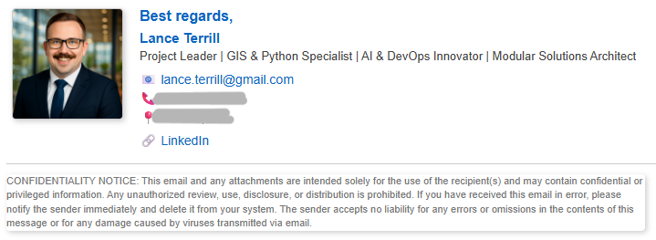

# EmailSig




A customizable email signature generator built with HTML and CSS. This project helps users create professional email signatures quickly and efficiently using Visual Studio Code and guidance from ChattyP (an AI assistant).

## Features

- Clean, responsive email signature templates
- Fully editable HTML and CSS
- Easy integration into email clients
- Lightweight and fast

## Tech Stack

- HTML
- CSS
- Visual Studio Code
- ChattyP (AI guidance)

## Installation

1. Clone the repository:

```bash
git clone https://github.com/username/EmailSig.git
cd EmailSig
